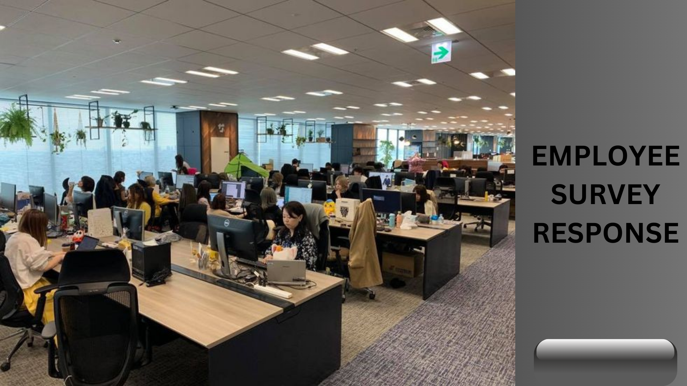
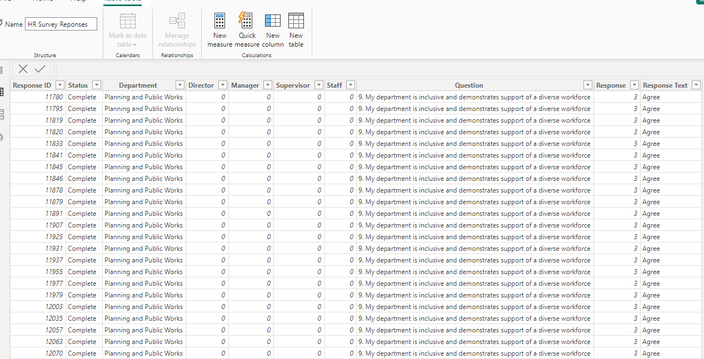
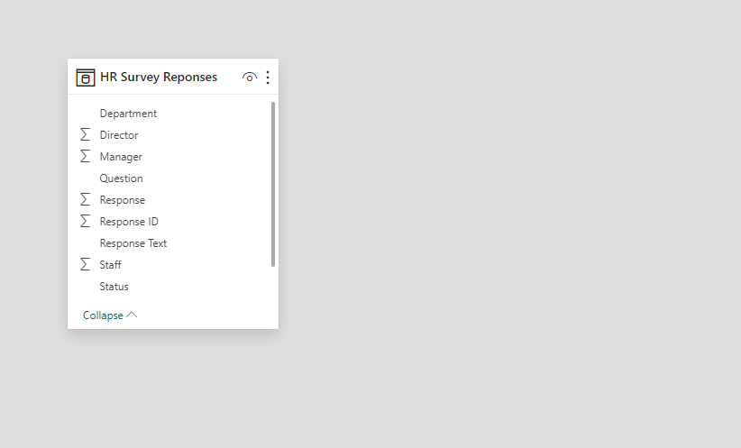

# Employee- Data-Survey-Responses

## INTRODUCTION
This dataset comprises responses obtained through an employee survey conducted by Pierce County WA. It was voluntarily completed by government employees and is presented as a single table containing 14,725 records with a total of 10 fields. 

## PROBLEM STATEMENT
Our task involves addressing the following inquiries:

1. Identify the survey questions that received the highest or lowest agreement from respondents.
   
2. Explore potential patterns or trends within the dataset based on department or role.

3. Propose actionable steps for employers to enhance employee satisfaction based on the survey results. Additionally, provide unique insights to complement the analysis.
   
## DATA SOURCING
For further analysis and exploration, you can access the dataset through:
Link to data source [here] (https://docs.google.com/spreadsheets/d/1nbhfp2ModgqDAPveYQG9CknRw2PYJQxbOTs3xSKOB8E/edit#gid=61186505)

## DATA TRANSFORMATION AND MODELLING
It's great to hear that the data came in clean without the need for modifications through power query😃. Additionally, the absence of any modeling requirements indicates a straightforward structure, as all survey information is contained within a table with ten columns.

Out of the 14,725 rows, it's noted that 14,590 are considered valid responses. The criteria for validity involve the _"Response" and "Response Text"_ columns, with 1% of the dataset featuring empty entries in these columns.
Table                   |   Data Model
:-----------------------:|:-----------------:
          |    

## DATA VISUALIZATION
This visualization was illustrated using bar chart, column chart and a matrix table in a single dashboard.

## INFERENCES AND RECOMMENDATION
There are 21 departments,11 questions were asked.
•	From the report of this survey majority of the respondents_ “Agree”_ to the question _“My department is inclusive and demonstrates support of a diverse workforce”_ Total of 633 respondents. Also, a maximum number of 469 Respondents disagree to the question _“I have a best friend at work”_

•	Majority of the respondents “Agree” (5,737) with all questions as well as _“Strongly agree”_ (5,236) out of the total 14,590 respondents although this varies in department.

•	Planning and public works department stands out with the highest number of managers (310) and staffs (560). while the Exec and director’s department is distinctive for having directors, totaling 170, in addition to managers and staff.

•	The Planning and Public Works department emerges as the most populated department in terms of survey responses, leading both in the "Agree" and "Strongly Disagree" categories. Specifically, they have 2,109 respondents who agreed with the survey questions and 1,491 respondents who strongly disagreed. This indicates a diverse range of opinions within the department.
It's notable that the majority of employees in this department appear to be content or satisfied with the survey questions. The data suggests a higher level of overall satisfaction compared to other departments in the organization.

This insight prompts further exploration into the factors contributing to the positive sentiment within the Planning and Public Works department. It could be beneficial to investigate specific aspects of their working conditions, benefits, or organizational culture that might be influencing their positive responses. This can provide valuable information for understanding and potentially replicating successful practices in other departments to enhance overall employee satisfaction across the organization. 

•	A maximum number of respondents “strongly disagree” and “Disagree” to the question _“In the last seven days, I have received recognition or praise for doing a good job”_.

As an employer this shows that according to their perception, they have not been acknowledged or appreciated for a job well done within that time frame, this impact can actually affect their morale, motivation and job satisfaction. Addressing this feedback could involve implementing recognition programs or communicate strategies to appreciate and acknowledge employees for their contributions.

•	Following the trend, a maximum number of respondents who choose  _“Strongly disagree”_ to the question _“My supervisor holds employees accountable for their performance”_

As an employee this indicates that in their perception that their supervisor may not be enforcing accountability or ensuring accountability among the team members. This issue can raise concerns like management, communication or expectations within the work space, it indicates a potential need for improvement in leadership by setting clear performance expectations or implementing clear accountability measures to enhance overall team performance.

•	Another noteworthy observation from the survey is that the majority of respondents indicate clarity regarding their job expectations. They are aware of what is expected of them at work. Additionally, it is highlighted that employees are not significantly distracted by the pursuit of forming best friendships in the workplace.

This suggests a positive aspect in terms of focus and understanding of job responsibilities among the surveyed employees. However, it's essential to delve deeper into the reasons behind the lack of emphasis on forming close friendships at work. It may reflect a professional and task-oriented work culture, or it could be an area for improvement in promoting a more collaborative and social workplace environment.

Further exploration and analysis can provide insights into the organizational culture and employee dynamics, allowing for targeted strategies to either reinforce positive aspects or address areas that may benefit from improvement in fostering workplace relationships.

## CONCLUSION

 Implementing these measures will contribute to positive work performance.

